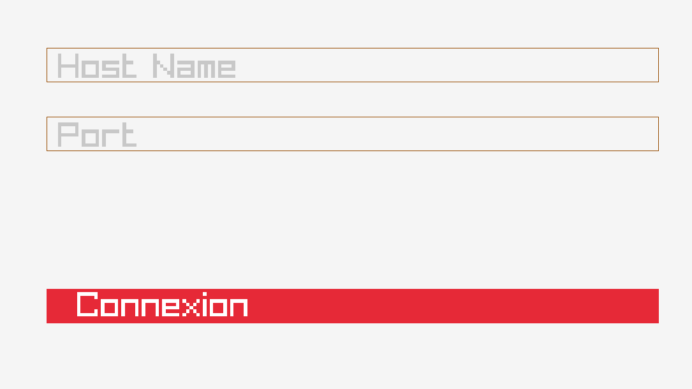

# R-Type 🚀


R-Type is a horizontally scrolling shooter arcade video game developed and released by Irem in 1987 and the first game in the R-Type series. The player controls a star ship, the R-9 "Arrowhead", in its efforts to destroy the Bydo, a powerful alien race bent on wiping out all of mankind. The R-9 can acquire a glowing orbicular device called a "Force", protecting it from enemy fire and providing additional firepower.

This version of the game is played in networks of up to 4 people.

## How to build 🛠️


If your on Linux you need CMake, on root of the project, execute:
```bash
./init.sh
```


If your on Windows, on root of the project, execute:
You need CMakeGUI and visualStudio to build the project.
With CMake GUI you have to select the root of the project and the build folder.
Then you have to configure and generate the project.
After that you can open the project with visualStudio and setup the startup project to the client and the server.
Then you can build the project.

## How to play 🛝
When you launch the executable, you will have connect to the server.
For that you will have to enter the ip address of the server and the port here is what it have to looks.
⚠️⚠️ Make sure the Server is running before you try to connect to it ⚠️⚠️


Once the connection is established, you will be placed on a waiting room where you will have to wait for the other players to connect.
When all the players are connected, the game you should press the Play button on your screen like that.
⚠️⚠️ Make sure all the players are connected before you press the Play button because there is no comeback once the game started ⚠️⚠️


After that, the game will start and you will have to destroy all the enemies to win the game. Good luck soldier 🫡🫡🫡!

The ship is controlled with the directional arrows and the space bar to shoot, more time you keep pressing the space bar more bigger is your shoot.

## Supported Platforms 🤝

| Platforms | Availability |
| :---    |  :---:  |
| Linux   | ✅ |
| Window  | ✅ |
| MacOs   | ❌ |

## Authors 🐐

<p align="center" width="100%">
  <a href="https://github.com/AlexGuillard">
    
  </a>
  <a href="https://github.com/Pablodeibar">
    
  </a>
  <a href="https://github.com/Benjicatch">
    
  </a>
  <a href="https://github.com/Kiya971">
    
  </a>
  <a href="https://github.com/azeuio">
    
  </a>
</p>

## Developer's Documentation 👷

- [Documentation](https://github.com/AlexGuillard/R-Type/wiki/Developer's-Documentation)

- [UDP Protocol](https://github.com/AlexGuillard/R-Type/wiki/Developer's-Documentation#udp-protocol-documentation)

- [Doxygen Documentation](https://alexguillard.github.io/R-Type/)

## License

[MIT](https://choosealicense.com/licenses/mit/)

